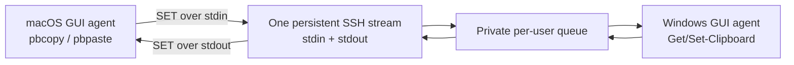

# Mac–Windows SSH Clipboard

[简体中文](README.zh-CN.md)

A minimal, text-only, bidirectional clipboard bridge between a logged-in macOS
desktop and a logged-in Windows desktop.

Only the Mac initiates SSH. One persistent SSH process carries both directions:
Mac-to-Windows over stdin and Windows-to-Mac over stdout. Windows never needs to
SSH back to the Mac.



## What it does

- Synchronizes nonempty plain text up to 1 MiB in both directions.
- Uses a single full-duplex SSH stream, not repeated network fetches.
- Starts in the Windows and macOS users' GUI login sessions.
- Keeps SSH clipboard access out of Windows Session 0.
- Uses acknowledgements, reconnect retry, and content-state loop suppression.

Local clipboard detection still runs at short intervals (0.2 seconds on macOS,
0.25 seconds on Windows), and the Windows SSH relay checks its private local
queue every 0.05 seconds. Those checks are local: they neither open new SSH
connections nor create periodic network requests. Detected changes are written
immediately to the already-open SSH byte stream.

## What it does not do

- Images, files, rich text, clipboard history, or iPhone sync.
- Guaranteed delivery of every rapid intermediate copy. The latest state wins.
- Empty-clipboard synchronization.
- Application-layer end-to-end encryption beyond SSH transport.

## Quick start

1. Complete [the new-computer SSH setup](docs/NEW-COMPUTER-SETUP.zh-CN.md).
2. On Windows, in a normal PowerShell window belonging to the desktop user:

   ```powershell
   Set-ExecutionPolicy -Scope Process Bypass
   .\windows\install.ps1
   ```

3. On the Mac:

   ```zsh
   chmod +x macos/*.zsh
   ./macos/install.zsh my-windows
   ```

   `my-windows` can be an SSH alias or `windows-user@windows-ip`.

4. Check status:

   ```powershell
   & "$env:LOCALAPPDATA\MacWindowsSSHClipboard\status.ps1"
   ```

   ```zsh
   ./macos/status.zsh
   ```

For AI-assisted installation, use [AGENTS.md](AGENTS.md) and the
[ready-to-copy Codex prompt](docs/CODEX-PROMPT.zh-CN.md).

## Uninstall

Run on Mac first:

```zsh
./macos/uninstall.zsh
```

Then run on Windows:

```powershell
.\windows\uninstall.ps1
```

## Security and reliability

- Clipboard payloads travel inside SSH.
- Windows queue files are restricted to the current user, SYSTEM, and local
  Administrators.
- Queue payloads in either direction can briefly exist as plaintext on the
  Windows disk.
- A Mac-to-Windows acknowledgement means the payload is durably queued; the GUI
  agent deletes it after processing. A Windows-to-Mac acknowledgement deletes
  the outbound payload. Deletion is not secure erasure.
- Do not expose TCP port 22 directly to the public Internet. Use a LAN or VPN.
- Never send an SSH private key, password, or clipboard content to an AI agent.

## License

MIT
